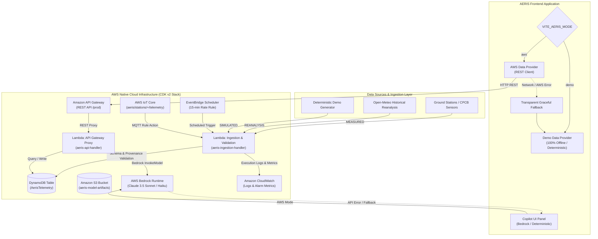

# AERIS AWS Production Architecture & Integration Document

This document provides the authoritative technical reference for the **AWS Production Layer of AERIS (AI Environmental Response & Intelligence System)**.

---

## 1. System Architecture Overview



---

## 2. AWS Services & Justification Matrix

| AWS Service | Architectural Role & Justification |
| :--- | :--- |
| **Amazon DynamoDB** | Single-table NoSQL storage for station telemetry and historical series (`PK = STATION#{id}`, `SK = TIMESTAMP#{iso}`). Provides low-latency key-value queries with on-demand billing. |
| **Amazon S3** | Storage for ML model artifacts, training checkpoints, and exported datasets. Configured with Block Public Access and server-side encryption. |
| **AWS Lambda** | Serverless ingestion and API routing handlers. Validates schema, domain bounds, and provenance without managing persistent servers. |
| **Amazon API Gateway** | Managed REST API exposing `/stations`, `/stations/{id}/latest`, `/stations/{id}/history`, and `POST /telemetry` with CORS and CloudWatch tracing. |
| **Amazon EventBridge** | Scheduled rate rule (15-minute interval) triggering periodic telemetry ingestion. |
| **AWS IoT Core** | MQTT topic rule (`aeris/stations/+/telemetry`) routing direct sensor messages to the Lambda ingestion pipeline. |
| **AWS Bedrock** | Serverless LLM provider for the Environmental Copilot (Claude 3.5 Sonnet / Claude 3 Haiku). |
| **Amazon CloudWatch** | Execution log groups and CloudWatch alarm metrics monitoring ingestion failure counts. |

---

## 3. Data Provenance Taxonomy

AERIS enforces strict, non-negotiable data provenance tagging at all boundaries. **Infrastructure routing (AWS) never alters data provenance.**

| Provenance Tag | Definition & Permitted Data Sources |
| :--- | :--- |
| `MEASURED` | Direct ground-station observations from calibrated monitoring sensors or IoT feeds. |
| `REANALYSIS` | Historical, gridded, or reanalysis meteorological/pollutant data (e.g., Open-Meteo ERA5 / CAMS). |
| `SIMULATED` | Deterministic generated demo telemetry used for offline development or testing. |
| `PREDICTED` | Machine learning model outputs (XGBoost 1h, LightGBM 6h, Persistence 24h). |
| `ESTIMATED` | Scenario sensitivity simulator projections based on sector emission reduction factors. |
| `AI-GENERATED` | Generative LLM explanations synthesized by AWS Bedrock. |

---

## 4. DEMO vs. AWS Runtime Modes

The application supports explicit runtime switching via environment variables:

```bash
# Demo Mode (100% Offline, Deterministic, Zero Cloud Dependency)
VITE_AERIS_MODE=demo

# AWS Mode (Uses API Gateway REST API & AWS Bedrock)
VITE_AERIS_MODE=aws
VITE_AERIS_API_URL=https://api.aeris-env.internal/prod
```

### Transparent Fallback Guarantee
If `VITE_AERIS_MODE=aws` encounters network unavailability, API Gateway HTTP 5xx errors, or DynamoDB throttles, the `AWSDataProvider` **automatically and transparently falls back to `DemoDataProvider`**. The user interface updates its health badge to `AWS (Degraded - Demo Fallback)` without crashing the dashboard.

---

## 5. Environment Variables Specification

```bash
# Frontend (.env or Vite runtime)
VITE_AERIS_MODE=demo                      # 'demo' | 'aws'
VITE_AERIS_API_URL=http://localhost:5173  # Production API Gateway endpoint URL

# Backend & CDK Infrastructure
AWS_REGION=us-east-1                      # AWS Region
BEDROCK_MODEL_ID=us.anthropic.claude-3-5-sonnet-20240620-v1:0  # Bedrock model identifier
```

> **SECURITY WARNING**: `VITE_*` environment variables are compiled into the client-side JavaScript bundle. **NEVER** place AWS Access Keys (`AKIA...`), Secret Access Keys, or private credentials into `VITE_*` variables.

---

## 6. Infrastructure as Code & Deployment Commands

The AWS infrastructure is defined using AWS CDK v2 under the `infra/` directory.

### Synthesis & Inspection Commands

```bash
# 1. Navigate to infrastructure directory
cd infra

# 2. Install dependencies
npm install

# 3. Typecheck infrastructure code
npm run build

# 4. Synthesize CloudFormation template (Does NOT deploy or spend money)
npm run synth
# or: npx cdk synth
```

---

## 7. Security & Least-Privilege IAM Model

1. **DynamoDB**: Encrypted at rest with AWS-managed keys (`TableEncryption.AWS_MANAGED`). Point-in-time recovery enabled.
2. **S3 Bucket**: `BlockPublicAccess.BLOCK_ALL` enabled. Public access policy blocked. SSL enforced.
3. **IAM Least-Privilege**:
   - `IngestionLambda`: Granted write access strictly to `AerisTelemetry` DynamoDB table and `AerisArtifactBucket` S3 bucket.
   - `ApiLambda`: Granted read/write access to `AerisTelemetry` table and `bedrock:InvokeModel` permission restricted strictly to the designated `BEDROCK_MODEL_ID` ARN.

---

## 8. Honest System Limitations & Scope

- **Demo Telemetry**: In `DEMO` mode, telemetry is generated deterministically from baseline seasonal distributions and historical patterns. It does not claim to be live CPCB ground sensor data.
- **EventBridge Schedule**: The EventBridge rule triggers simulated/reanalysis ingestion every 15 minutes unless connected to an authenticated CPCB/IoT telemetry producer.
- **Scenario Simulator**: Scenario calculations represent empirical sensitivity estimates rather than causal fluid-dynamic atmospheric dispersion models.

---
